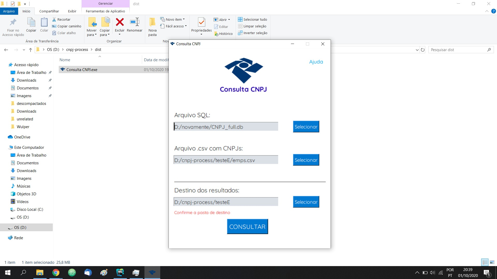

# Consulta CNPJ

This is a tool built on top of FabioSerpa's amazing [repo](https://github.com/fabioserpa/CNPJ-full).

I might improve it to add more functions that already are on Fabio's CLI implementation, but currently **this repository** consists in a **GUI** to find information about companies and associates identified by **a CSV of CNPJs**.

Mind that the resulting CSV files are post-processed to be displayed in Excel, and every decision made favors a Microsoft environment, which well represents the demographic that may use a GUI for such task.

## How to use it:
 1. Use FabioSerpa's code to generate a **.db file** with indexed CNPJ data.
 2. Clone this repo and change the paths inside ``consulta.spec`` according to your directories.
 3. Run ``pip install pyinstaller`` on your python env and run ``pyinstaller consulta.spec`` in this repo.
 4. Click on the ``build\consulta CNPJ.exe`` that has just been created.
 5. Follow the instructions displayed on screen and wait until the error/success window shows up.
 
## Current interface:

This repository is under the terms specified at GNU General Public License v3.0
